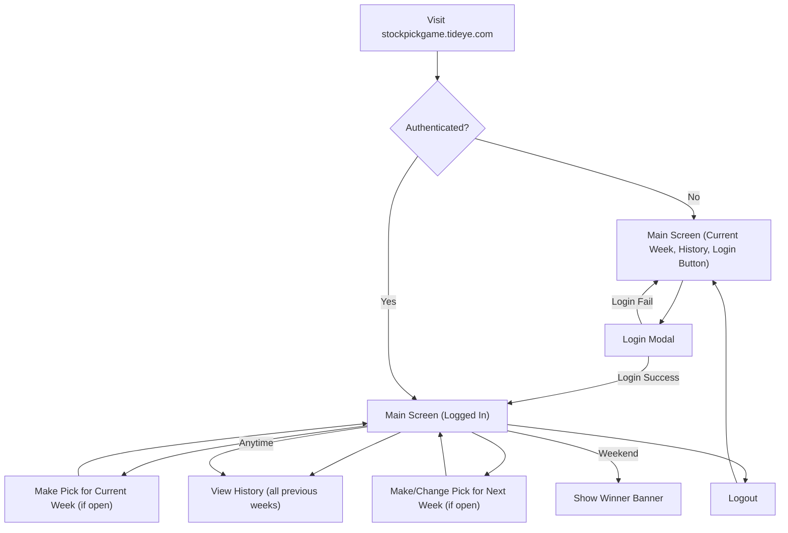

# Stock Pick Game: Flow Diagram & Rules

## Flow Diagram

- All navigation is on a single page.
- Login is a modal, not a separate page.
- Pick modals are overlays, not separate pages.
- History and scoreboard are always visible below the current week.
- Winner is shown prominently on weekends.

---

## Game Rules

### Players

- Only three players: Patrick, Logan, Taylor.

### Authentication

- Simple username/password login.
- JWT token, valid for 1 year, refreshed on each visit.
- Login state persists via localStorage.

### Game Flow

- **Each week:** Each player picks one stock before Sunday 23:59.
- If a player does not make a pick, their previous week's pick rolls over.
- Picks are locked after Sunday 23:59 for the upcoming week.

### Scoring

- The winner is the player with the highest percentage gain from **Monday open** to **Friday close**.
- If a day is a holiday, use the previous trading day's open/close.
- All picks and results are shown in a table for the current week.
- Previous weeks' results are shown in a history section.

### UI/UX

- Only one main screen.
- Login/logout handled via modal.
- Current week, next week pick, and history are all visible.
- Winner is shown prominently on weekends.
- Stock info includes: symbol, Monday open, daily open/close, and return %.

### Admin/Backend

- All endpoints are protected.
- Only the three users can log in and make picks.
- JWT is required for all pick submissions.

</rewritten_file>
